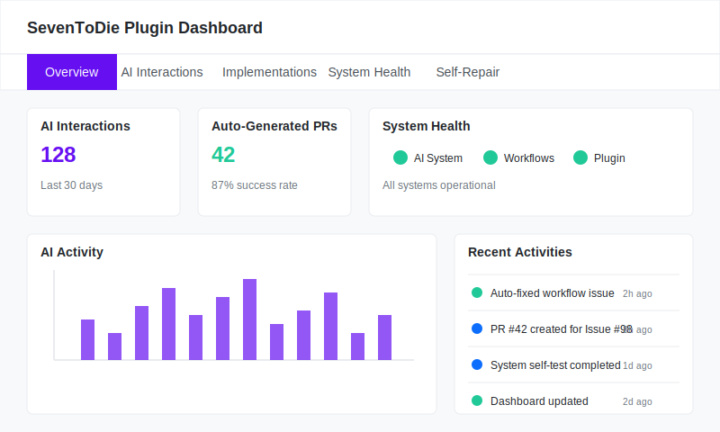

# SevenToDie: 7 Days To Die in Minecraft

A comprehensive Minecraft server plugin that recreates 7 Days To Die gameplay mechanics on Paper 1.21.4, featuring a fully autonomous AI-powered development system.

> 🤖 **Fully Autonomous Development**: This project uses an AI-powered autonomous development system that works 24/7 to analyze, fix, and improve code with minimal human intervention. [Learn how it works](.github/AI_DEVELOPMENT.md)

## 🚀 Quick Access

<table>
  <tr>
    <td align="center">
      <a href="https://yourusername.github.io/seventodie/">
         AI Dashboard
      </a>
    </td>
    <td align="center">
      <a href=".github/AI_DEVELOPMENT.md">
         AI Documentation
      </a>
    </td>
    <td align="center">
      <a href="https://github.com/yourusername/seventodie/actions">
         GitHub Actions
      </a>
    </td>
  </tr>
  <tr>
    <td align="center">
      <a href="https://github.com/yourusername/seventodie/issues/new?assignees=&labels=enhancement&template=feature_request.md">
         Request Feature
      </a>
    </td>
    <td align="center">
      <a href="https://github.com/yourusername/seventodie/issues/new?assignees=&labels=bug&template=bug_report.md">
         Report Bug
      </a>
    </td>
    <td align="center">
      <a href="plugin/target/">
         Download Plugin
      </a>
    </td>
  </tr>
</table>

## Repository Structure

This repository is organized as a comprehensive mono-repo that contains:

- **`/plugin`**: The main Minecraft plugin code
  - Java code for the SevenToDie plugin
  - Maven build files
  - Resource files
  
- **`/dashboard`**: Web-based monitoring dashboard and control panel
  - Next.js frontend for viewing project stats
  - Autonomous development tracking
  - Issue and PR monitoring
  
- **`/.github`**: CI/CD and autonomous development system
  - GitHub Actions workflows
  - AI scripts for self-improvement
  - Autonomous development tools

## Features

- **Custom Building System**: Frame-based building system with upgradable blocks
- **Zombie Hordes**: Dynamic zombie spawning with increased difficulty over time
- **Trader NPCs**: Special traders that offer quests and items
- **Quest System**: Complete quests to earn rewards and progress
- **Structure Generation**: Custom structures in the world
- **Specialized Tools**: Tools designed for the building system

## Autonomous Development

This project features a revolutionary development approach where AI actively maintains and enhances the code while you focus on creative decisions.

### How It Works

1. **You Create Issues**: Just describe bugs, features, or improvements as GitHub issues
2. **AI Responds Naturally**: The system processes your issue and responds like a human developer
3. **Autonomous Implementation**: The AI analyzes, codes, tests, and creates pull requests
4. **You Review Changes**: You maintain control by reviewing and approving PRs
5. **Continuous Improvement**: The system proactively improves the codebase even while you sleep

### AI Commands

You can direct the AI using commands in issue comments:

| Command | Description |
|---------|-------------|
| `/ai fix` | Request a bug fix |
| `/ai implement` | Request a feature implementation |
| `/ai analyze` | Request detailed analysis |
| `/ai status` | Check implementation status |
| `/ai help` | Show all available commands |

### Asynchronous Development

The autonomous system works continuously:
- It can develop while you're away
- It handles routine maintenance and testing
- It proactively suggests improvements
- It responds to community issues and PRs

### Dashboard Control Center

The project includes a comprehensive dashboard for monitoring and controlling the autonomous system:

  

**Dashboard Features:**
- Real-time autonomous system status monitoring
- Activity logs for AI interactions and implementations
- System health metrics and self-repair tracking
- Issue and PR analytics

**Access the dashboard:** [Visit GitHub Pages Dashboard](https://yourusername.github.io/seventodie/)

Learn more about this system in the [AI Development Guide](.github/AI_DEVELOPMENT.md).

## Development Setup

### Setting Up Autonomous Development

1. Clone this repository
2. [Add the OpenAI API key](.github/AI_DEVELOPMENT.md#setup) to your repository secrets
3. Create an issue to begin interacting with the AI

### Building with GitHub Actions

The plugin is automatically built when changes are pushed. You can view build results in the "Actions" tab.

### Local Development Setup

If you prefer local development alongside the AI:

1. Install JDK 21
2. Clone this repository
3. Build with Maven: `mvn package`
4. Copy the resulting JAR from the `target` folder to your Paper server's `plugins` folder

## Project Structure

- `src/main/java/com/seventodie/`: Main plugin code
  - `blocks/`: Building system and frame blocks
  - `commands/`: Command handlers
  - `listeners/`: Event listeners
  - `quests/`: Quest system
  - `tools/`: Tool management
  - `traders/`: Trading system
  - `utils/`: Utility classes
  - `worldgen/`: World generation
- `.github/`: Autonomous development system
  - `workflows/`: AI workflow definitions
  - `scripts/`: AI processing scripts

## Contributing

You can contribute in two ways:

1. **Direct Development**:
   - Fork the repository
   - Create a feature branch: `git checkout -b my-new-feature`
   - Commit your changes: `git commit -am 'Add some feature'`
   - Push to the branch: `git push origin my-new-feature`
   - Submit a pull request

2. **AI-Assisted Development**:
   - Create a detailed issue describing what you want to add or fix
   - The AI will assist you or implement it for you
   - Review and approve the AI-generated pull request

## License

[MIT License](LICENSE)